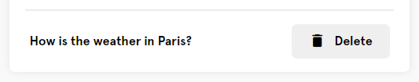
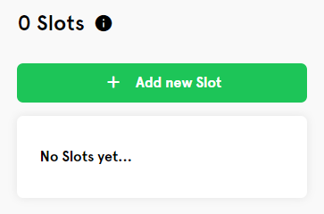
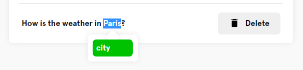
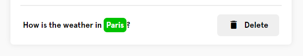
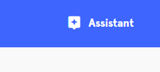
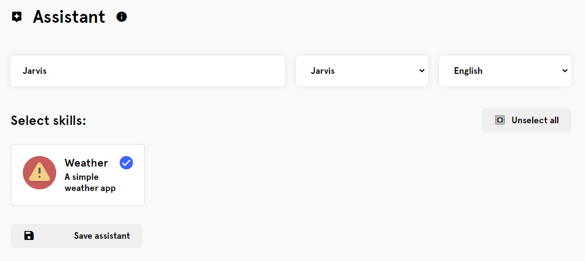

# Jarvis Server

Web UI for <a href="https://github.com/open-jarvis/jarvis">Jarvis</a>. Create new skills, intents, slots, datasets and an assistant within minutes.

## Contents

* [Prerequisites](#prerequisites)
* [Installation](#installation)
* [Usage](#usage)
	1. [Create a skill](#1-create-a-skill)
    	* [Name](#name)
    	* [Script path](#script-path)
    	* [Description](#description)
	2. [Create an intent](#2-create-an-intent)
	3. [Add training examples](#3-add-training-examples)
	4. [Add a slot](#4-add-a-slot)
    	* [Slot name](#slot-name)
    	* [Training values](#training-values)
    	* [Tweak the settings](#tweak-the-settings)
	5. [Set up your assistant](#5-set-up-your-assistant)

## Prerequisites

This project can be installed on every device with an apache http server.  
It's recommended to use a Raspberry Pi 3B+ (at least 16GB disk space) with a running <a href="https://github.com/open-jarvis/server">Jarvis Server</a> instance.

## Installation

This project can be cloned right into the document root of your http server.  
If you have no apache server running yet, install it with the following commands:

``` bash
# update your system
sudo apt update -y

# install python framework
sudo -H pip3 install --upgrade flask
```

After you successfully installed the apache server, clone the project into the document root:

``` bash
JARVIS_INSTALLDIR=/jarvis/server
# clear web directory, if files already exist
sudo rm -rf $JARVIS_INSTALLDIR/*

# clone the repo right into the document root
cd $JARVIS_INSTALLDIR
git clone https://github.com/open-jarvis/web .
rm -rf $JARVIS_INSTALLDIR/readme-assets # deletes unused images
```

## Usage

This Web UI is the dashboard and control center for your Jarvis assistant.
Jarvis uses a skill and intent structure to filter spoken voice and convert it into machine-readable format.  

### 1) Create a skill  

A skill is a container for intents (I'll explain intents later on).  
All of your skills have a name, a logo and an executable path.

Go to 127.0.0.1 (or your Raspberry Pi IP Address) and click "Add a skill".


Fill in all the fields:

#### Name

Specify a name for your skill <b>Weather</b>, <b>Calculator</b>, or <b>Lights</b> would be awesome names.

#### Script path

This is the name of your skill directory (eg. <b>weather</b> for /home/pi/jarvis/skills/<b>weather</b>). This directory needs to contain a <b> `skill.py` </b> file which is called if an intent of type <b>Weather</b> gets detected.

#### Description

Add a short description. This is optional but good for documentation purposes.


### 2) Create an intent

Intents are used to break down a skill into smaller parts (actions).  
A good intent for a skill called <b>Weather</b> would be <b>getCurrentWeather</b> or <b>getWeatherForecast</b>.  
You can add as many intents as you want to a skill.  
<br>
Click "Create Intent" and enter the intent name (needs to be [A-Za-z0-9_-]), press ok and click on the box that just appeared.


### 3) Add training examples

Type your training examples (sample sentences) and press enter or "Add":


### 4) Add a slot

As you add more and more examples, you'll soon get to a point where you can't add any more static texts and need some dynamic context (like cities, countries, songs, people, etc...).

For example: What should Jarvis do with "Paris" in this sentence? How should he filter it out?



That's what slots are for! Create a new slot by clicking "Add new Slot" and "Create new Slot"




#### Slot name

Add a name for your slot. <b>city</b> would be a good choice.

#### Training values

Enter "Paris" and press enter. If you know any other names for Paris, enter them in the "Synonyms field".

#### Tweak the settings

This Web UI also gives you the option to tweak the more advanced settings.  
By hovering over the info boxes, you'll get more detailled information on the settings. It's recommended to leave them as-is though.
  
Click "Back" and select the slot you just created. It'll be added to the intent you were editing. The slots container should look like the following now:


When you select the text "Paris" in the training example, you'll see a tooltip where you can choose a slot.




We only added one slot for our example, but you can add an unlimited amount of slots to your intents and training examples.

### 5) Set up your assistant

Click on the "Assistant" button in the navigation bar.



Fill in a name for your assistant, the wakeword and the language:



Congratulations! You've just created your first AI home assistant.  
Now, you just need to go to `/home/pi/jarvis/skills/weather/` and add a good backend (in `skill.py` ). More on how to write a good skill can be found here: <a href="https://open-jarvis.github.io/">https://open-jarvis.github.io/</a>
