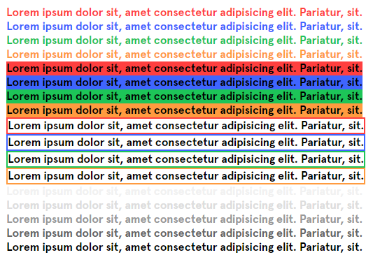
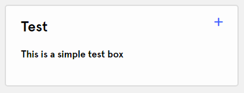
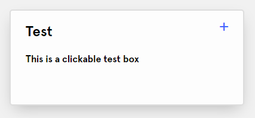
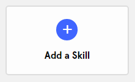
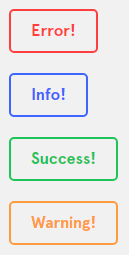
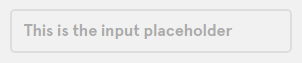
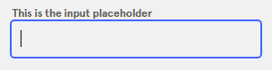

# Design elements

## Contents

* [Including in your project](#including-in-your-project)
* [CSS / Layout](#css--layout)
    - [Colors](#colors)
    - [Grid Layout](#grid-layout)
    - [Boxes](#boxes)
        * [Simple Box](#simple-box)
        * [Clickable Box](#clickable-box)
        * [Centered Box](#centered-box)
    - [Buttons and inputs](#buttons-and-inputs)

## Including in your project

``` html
<link rel="stylesheet" href="/css/jarvis.css">
<script type="module" src="/js/jarvis.js"></script>
```

## CSS / Layout

### Colors

``` html
<span class="red"></span>
<span class="blue"></span>
<span class="green"></span>
<span class="orange"></span>
<div class="bg-red"></div>
<div class="bg-blue"></div>
<div class="bg-green"></div>
<div class="bg-orange"></div>
<div class="border-red"></div>
<div class="border-blue"></div>
<div class="border-green"></div>
<div class="border-orange"></div>

<span class="light-grey"></span>
<span class="grey"></span>
<span class="dark-grey"></span>
<span class="darker-grey"></span>
<span class="light-dark"></span>
```



### Grid Layout

> Packages used:  
> https://simplegrid.io/  
> https://swup.js.org/

``` html
<div id="swup" class="container">
    <!-- Swup is being used for smooth page transitions -->
    <!-- Simplegrid has a total column count of 12 -->
    <div class="row">
        <div class="col-6"></div>
        <div class="col-3"></div>
        <div class="col-3"></div>
    </div>
</div>
```

### Boxes

#### Simple Box

``` html
<div class="box">
    <label>Test</label>
    <p>This is a simple test box</p>
    <i class="blue">add</i>
</div>
```



#### Clickable Box

``` html
<div class="box clickable">
    <label>Test</label>
    <p>This is a clickable test box</p>
    <i class="blue">add</i>
</div>
```



#### Centered Box

``` html
<div class="box clickable centered">
    <div class="icon bg-blue"><i>add</i></div>
    <span>Add a Skill</span>
</div>
```




### Buttons and inputs

#### Buttons
``` html
<button class="red">Error!</button>
<button class="blue">Info!</button>
<button class="green">Success!</button>
<button class="orange">Warning!</button>
```




#### Inputs

```html
<div class="input">
    <input type="text" placeholder=" "> <!-- placeholder=" " is important! -->
    <span>This is the input placeholder</span>w
</div>
```


